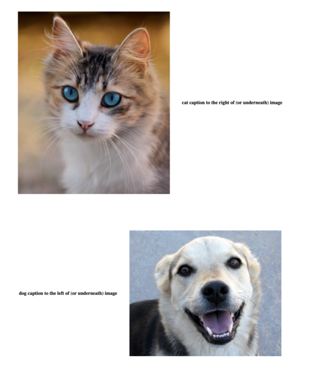
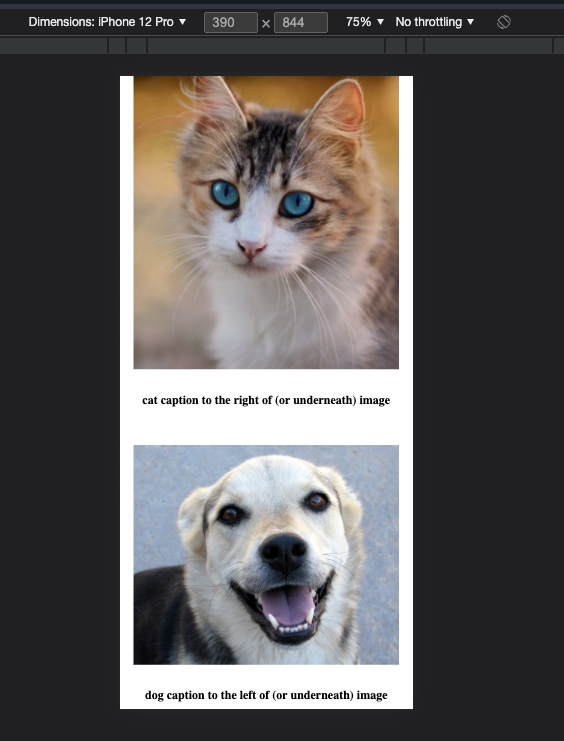

#

[Just show me the code](https://github.com/blairnangle/dynamic-gatsby-layout-with-css-media-queries).

## Goal

I wanted to conditionally change the relative positions of a list of image-caption pairs based on the user's device viewport width.

### Desired desktop appearance



### Desired mobile appearance



## Problem

Ordinarily when working with conditional rendering in React, I would just use JavaScript to detect the relevant user-specific state and then have some logic to return a modified or completely different component. However, due to
[Gatsby's static server-side rendering](#gatsbys-static-server-side-rendering) mechanism, standard methods for determining a user's device type in JavaScript were suboptimal for the static site I was building.

## Solution

### Overview

- Use media queries to check for screen size, with different styles for big and small screens
- Use `order` to have the caption on the left or right of the image (or above or below in the case of small screens)
- Reverse the order of the second image-caption pair in the case of small screens so that captions are always underneath images

### Method

For simplicity's sake, we'll define an array of objects in code that include statically imported images (rather than playing around with a GraphQL query):

```javascript
import cat from '../images/cat.jpg';
import dog from '../images/dog.jpg';

const IndexPage = () => {
  const captionedImages = [
    {
      src: cat,
      caption: 'cat caption to the right of (or underneath) image',
      captionPosition: 'right',
    },
    {
      src: dog,
      caption: 'dog caption to the left of (or underneath) image',
      captionPosition: 'left',
    },
  ];
}
```

We can then map over this array to construct our list of captioned images:

```javascript
return (
  captionedImages.map((ci) => CaptionedImage(ci.src, ci.caption, ci.captionPosition))
);
```

Where `CaptionedImage` is defined as:

```javascript
import React from 'react';
import CaptionedImageStyles from '../styles/CaptionedImageStyles';

function CaptionedImage(src, caption, captionPosition) {
  return (captionPosition.toLowerCase() === 'right'
    ? (
      <CaptionedImageStyles>
        <div className="captioned-image-container">
          <div className="captioned-image">
            
            <h4 className="caption caption1">{caption}</h4>
          </div>
        </div>
      </CaptionedImageStyles>
    ) : (
      <CaptionedImageStyles>
        <div className="captioned-image-container">
          <div className="captioned-image">
            <h4 className="caption caption2">{caption}</h4>
            
          </div>
        </div>
      </CaptionedImageStyles>
    )
  );
}

export default CaptionedImage;
```

This component definition makes sense when thinking about the relative left/right image/caption positioning (assuming a row-based flexbox), but won't work for above/below positioning (without some CSS trickery).
This is where `CaptionedImageStyles` comes in:

```javascript
import styled from 'styled-components';

const CaptionedImageStyles = styled.header`
  .captioned-image-container {
    @media (min-width: 768px) {
      .captioned-image {
        align-items: center;
        display: flex;
        flex-direction: row;
        padding: 60px;
        justify-content: center;
      }
      .image {
        padding-left: 20px;
        padding-right: 20px;
        max-width: 500px
      }
      .image.image1 {
        order: 1
      }
      .image.image2 {
        order: 2
      }
      .caption {
        padding-left: 20px;
        padding-right: 20px;
      }
      .caption.caption1 {
        order: 2
      }
      .caption.caption2 {
        order: 1
      }
    }
    @media (max-width: 767px) {
      .captioned-image {
        align-items: center;
        display: flex;
        flex-direction: column;
        padding: 10px;
        justify-content: center;
      }
      .image {
        max-width: 100%;
        height: auto;
      }
      .image.image1 {
        order: 1;
      }
      .image.image2 {
        order: 1;
      }
      .caption {
        padding: 10px;
      }
      .caption.caption1 {
        order: 2;
      }
      .caption.caption2 {
        order: 2;
      }
    }
  }
`;
```

`@media (max-width: 767px)` is standard CSS media query logical operator syntax for applying styling to devices with viewports below a certain width (767 should cover all phones and most tablets—of course, this same method can be applied to more granular
viewport widths and layouts). The *clever* parts are changing the `flex-direction` for mobile compared to desktop and using `order` to override the relative positions of `div` and `img` elements within the `captioned-image` CSS class. Notice the different
values for `order` for smaller screen sizes—we always want the caption to come after the image, regardless of the order of elements within the `div`.

The slightly unusual CSS syntax (e.g., `.image.image1`) is making use of [CSS inheritance](#css-inheritance) to reduce code duplication.

## Notes

### Gatsby's static server-side rendering

Unless configured to use server-side rendering or delayed static site generation (which are both more appropriate for large/media-heavy sites and only [available since Gatsby v4](https://www.gatsbyjs.com/gatsby-4/)), Gatsby generates the entire HTML for the
site at build-time. Note that the Gatsby project uses the term "server-side rendering" (SSR) to refer to dynamic sever-side rendering—i.e., HTML that is only created on request from the client. New Gatsby 4 features aside, Gatsby creates the HTML for all pages
at build/compile-time—this method is referred to in the wider web dev space as SSR.

Generating the necessary HTML at compile-time makes page loading extremely fast but also means that, if JavaScript is used to generate some elements at runtime based on user state (e.g., browser viewport width), a *second-pass render* will need to occur. This
can manifest as a flash or the wrong content/layout being shown initially for the user.

[Josh Comeau](https://twitter.com/joshwcomeau) sums it up well in [this](https://www.joshwcomeau.com/react/the-perils-of-rehydration/) blog post:

> *When working in Gatsby/Next apps, I've found it really helpful to think in terms of a two-pass render. The first pass happens at compile-time, wayyy ahead of time, and sets the foundation for the page, filling in everything that is universal for all users. Then, much later, a second-pass render will fill in the stateful bits that vary from person to person.*

For situations where an additional render is required, Josh has an [elegant solution](https://www.joshwcomeau.com/react/the-perils-of-rehydration/#the-solution). And [Ferran Buireu](https://twitter.com/fbuireu) has a
[nice workaround](https://stackoverflow.com/a/65166867/4304123), specifically for navigation bars.

### CSS inheritance

It is possible to combine properties from child and parent CSS classes to style an element:

```javascript

```

Using the CSS definitions above, this `img` element would end up with a union of `image` and `image1` styles—i.e.,

```javascript
`
padding-left: 20px;
padding-right: 20px;
max-width: 500px;
order: 1;
`
```
