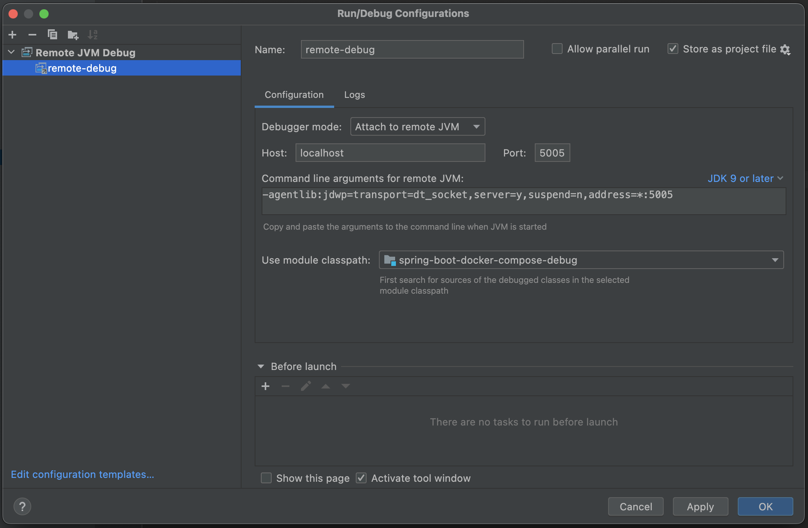
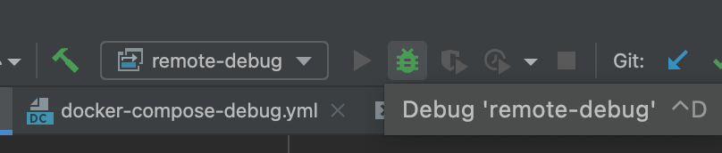
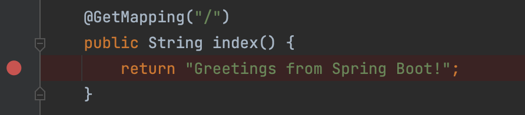

#

[Just show me the code](https://github.com/blairnangle/spring-boot-docker-compose-debug).

## Goal

Using IntelliJ, debug a running Spring Boot app that was launched with Docker Compose (and create a bare-bones, reliable example).

## Problem

Following the JetBrains [tutorial](https://www.jetbrains.com/help/idea/run-and-debug-a-spring-boot-application-using-docker-compose.html) resulted in a bloated solution that worked inconsistently.

## Solution

- Create a separate Docker Compose file for the debug configuration: `docker-compose-debug.yml`
- Note the additional port exposure and environment variables
- Also note that for this simple example we are fine to share a Dockerfile between standard and debug configurations
- Create a "Remote JVM Debug configuration" (if you cloned the [associated repo](https://github.com/blairnangle/spring-boot-docker-compose-debug), this should already be present in IntelliJ):



- Run the Docker Compose file—I have created a convenience script, `debug.sh`, that ensures source code changes are always included
- Attach the aforementioned debugger:



- Add a breakpoint:



- Hit the endpoint to see it work! E.g.,

```shell
curl -v localhost:8080
```
